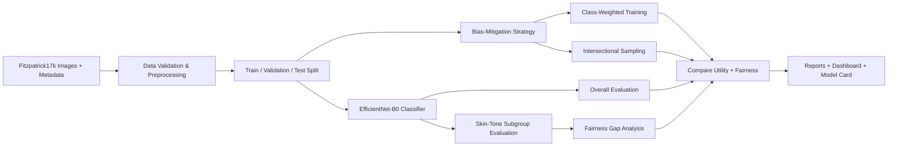

# FairSkin-AI


<p align="center">
  
</p>


### Fairness-Aware Dermatology Image Classification Across Skin-Tone Groups

**FairSkin-AI** is a reproducible deep-learning research prototype for auditing and mitigating subgroup performance disparities in dermatology image classification. The project evaluates whether a model performs consistently across **Fitzpatrick skin-tone groups** and tests simple mitigation strategies that aim to reduce performance gaps without sacrificing overall predictive utility.

> **Research use only.** This project is not a medical device and must not be used for diagnosis, triage, or treatment decisions.

---

## Research Question

> **How consistently does a dermatology image classifier perform across Fitzpatrick skin-tone groups, and can simple bias-mitigation strategies reduce subgroup performance disparities without substantially degrading overall performance?**

The project is designed as a compact research pipeline rather than a single notebook. Its focus is not only predictive accuracy, but also **model behavior across clinically relevant subgroups, reproducibility, uncertainty in evaluation, and transparent reporting**.

---

## Why This Project

Medical-image models can achieve strong aggregate performance while still behaving differently across demographic or phenotypic subgroups. In dermatology, this issue is particularly important because image appearance varies with skin tone, dataset composition, annotation quality, acquisition conditions, and disease prevalence.

FairSkin-AI therefore evaluates **utility and fairness together**. Instead of reporting only one overall score, it measures performance separately for multiple skin-tone groups, quantifies disparity gaps, and compares mitigation strategies under the same experimental protocol.

This direction is closely related to current research themes in the **Hamarneh Medical Image Analysis Lab at Simon Fraser University**, including dermatology dataset quality, annotation reliability, and fairness in medical image analysis. This repository is an **independent research/learning project** and is not presented as work conducted by or endorsed by the lab.

---

## Key Contributions

- End-to-end **PyTorch** training and evaluation pipeline
- Transfer learning with **EfficientNet-B0** as the default backbone
- Support for **ResNet-18**, **ResNet-50**, and a lightweight TinyCNN for smoke testing
- Reproducible train/validation/test splitting
- Three-group skin-tone audit: **Fitzpatrick I–II, III–IV, V–VI**
- Overall and subgroup performance reporting
- Bias-mitigation experiments using:
  - **class-weighted loss**
  - **intersectional sampling** across diagnosis × skin-tone group
- Bootstrap confidence intervals for subgroup macro-F1
- Saved predictions, checkpoints, resolved configuration, and fairness reports
- Interactive **Streamlit** dashboard for model inspection
- Automated tests and **GitHub Actions CI**
- Docker support for reproducible execution

---

## System Overview



---

## Dataset

The pipeline is designed for **Fitzpatrick17k**, a dermatology image dataset containing clinical images, diagnostic labels, and Fitzpatrick skin-type annotations.

For the main experiment, the project uses the dataset's **three broad diagnostic partitions** when available:

- `benign`
- `malignant`
- `non-neoplastic`

For subgroup analysis, Fitzpatrick types are grouped as:

- **Group 1:** I–II
- **Group 2:** III–IV
- **Group 3:** V–VI

The Fitzpatrick scale has important limitations: it was created around skin response to sun exposure and should **not** be treated as a perfect proxy for race, ethnicity, or objective skin color. Results are therefore interpreted as a **dataset/model audit**, not as a claim of clinical fairness.

---

## Methodology

### 1. Baseline model

The default experiment fine-tunes **EfficientNet-B0** using transfer learning. Training behavior is controlled through `configs/base.yaml`, including learning rate, batch size, image resolution, dropout, label smoothing, patience, and random seed.

### 2. Bias-mitigation experiments

Two lightweight mitigation strategies are implemented for controlled comparison:

**Class-weighted loss**  
Compensates for diagnostic class imbalance by assigning larger loss weights to underrepresented classes.

**Intersectional sampling**  
Balances training exposure across combinations of **diagnostic class × skin-tone group**, reducing the chance that majority combinations dominate optimization.

### 3. Evaluation

The project reports:

- Accuracy
- Balanced accuracy
- Macro precision
- Macro recall
- Macro F1-score
- Per-group metrics for I–II, III–IV, and V–VI
- Max-minus-min subgroup performance gaps
- Bootstrap confidence intervals for subgroup macro-F1

The intended comparison is not "which model has the smallest fairness gap" in isolation. A mitigation method is useful only when its fairness improvement is considered together with **overall model utility and uncertainty**.

---

## Repository Structure

```text
FairSkin-AI/
├── app/
│   └── app.py                     # Streamlit dashboard
├── configs/
│   └── base.yaml                  # Reproducible experiment configuration
├── data/
│   └── DATA_README.md             # Dataset preparation notes
├── docs/
│   ├── MODEL_CARD_TEMPLATE.md     # Transparent model documentation
│   ├── RESEARCH_PROPOSAL.md       # Mini research proposal
│   └── CV_BULLETS.md              # Concise project summary
├── fairskin_ai/
│   ├── checkpoint.py
│   ├── data.py
│   ├── engine.py
│   ├── fairness.py
│   ├── model.py
│   └── utils.py
├── scripts/
│   ├── prepare_fitzpatrick.py     # Download / standardize metadata and images
│   ├── train.py                   # Baseline and mitigation training
│   ├── evaluate.py                # Independent checkpoint evaluation
│   ├── compare_runs.py            # Compare completed experiments
│   ├── make_report.py             # Generate shareable result summaries
│   └── make_synthetic_demo.py     # End-to-end software smoke test
├── tests/                          # Unit tests
├── .github/workflows/ci.yml       # Continuous integration
├── Dockerfile
├── requirements.txt
├── pyproject.toml
├── run_demo.bat
├── run_demo.sh
└── VALIDATION.md
```

---

## Quick Start

### Windows / VS Code

```powershell
cd FairSkin-AI
py -3.11 -m venv .venv
.\.venv\Scripts\Activate.ps1
python -m pip install --upgrade pip
pip install -r requirements.txt
python -m pytest -q
```

If PowerShell blocks environment activation:

```powershell
Set-ExecutionPolicy -Scope Process -ExecutionPolicy Bypass
.\.venv\Scripts\Activate.ps1
```

### Software smoke test

The repository includes a synthetic-data smoke test that verifies the full software pipeline without requiring medical data.

```powershell
.\run_demo.bat
```

> Synthetic data is used only for software validation. Its metrics must **not** be reported as scientific results.

---

## Prepare Fitzpatrick17k

```powershell
python scripts\prepare_fitzpatrick.py
```

For a small download test:

```powershell
python scripts\prepare_fitzpatrick.py --limit 300
```

The preparation script:

1. obtains dataset metadata;
2. keeps rows with valid Fitzpatrick types and usable diagnostic labels;
3. attempts to retrieve source images;
4. records failed image downloads;
5. creates a standardized metadata file containing only usable samples.

Some original source-image links in Fitzpatrick17k may no longer be available. The pipeline records these failures rather than silently including invalid samples.

---

## Run Experiments

### Baseline

```powershell
python scripts\train.py `
  --config configs\base.yaml `
  --mode baseline `
  --output-dir artifacts\baseline
```

### Class-weighted training

```powershell
python scripts\train.py `
  --config configs\base.yaml `
  --mode class_weighted `
  --output-dir artifacts\class_weighted
```

### Intersectional sampling

```powershell
python scripts\train.py `
  --config configs\base.yaml `
  --mode intersectional_sampler `
  --output-dir artifacts\intersectional
```

### Compare experiments

```powershell
python scripts\compare_runs.py `
  artifacts\baseline `
  artifacts\class_weighted `
  artifacts\intersectional
```

---

## Experiment Outputs

Each run produces a self-contained artifact directory:

```text
artifacts/<run>/
├── best_model.pt
├── class_to_idx.json
├── fairness_report.json
├── history.csv
├── predictions.csv
├── resolved_config.json
├── run_summary.json
└── splits/
    ├── train.csv
    ├── val.csv
    └── test.csv
```

This makes each experiment independently inspectable and easier to reproduce.

---

## Interactive Dashboard

After training a checkpoint:

```powershell
streamlit run app\app.py
```

The dashboard supports model inspection, prediction confidence, and subgroup-context reporting. The Fitzpatrick selector is **manual contextual input**; the application does not claim to infer a person's skin type automatically from an image.

---

## Reproducibility and Engineering Quality

The repository uses:

- fixed random seeds
- saved train/validation/test splits
- saved resolved configuration for every run
- explicit checkpoint metadata
- deterministic settings where supported
- no hidden notebook state
- unit tests
- CI smoke tests
- separate synthetic validation data and real research data

### Validation status

Before packaging, the repository was mechanically checked with:

- Python bytecode compilation
- **4 passing unit tests**
- an end-to-end synthetic training run
- checkpoint reload and independent evaluation
- experiment-comparison script execution

These checks validate the **software pipeline**, not scientific performance on Fitzpatrick17k. Real-data conclusions should only be made after completing the full experiment on the real dataset.

---

## Current Research Status

**Engineering pipeline:** complete and validated  
**Real Fitzpatrick17k experiment:** ready to run  
**Scientific results:** intentionally not pre-filled

No performance numbers are claimed in this README until they are produced from the real-data experiment. This separation is deliberate to avoid presenting synthetic smoke-test results as research findings.

---

## Limitations

- Fitzpatrick type is an imperfect representation of skin appearance and should not be conflated with race or ethnicity.
- Dataset imbalance, label noise, source-domain bias, image quality, and unavailable image URLs may affect results.
- A small subgroup sample size can make disparity estimates unstable.
- Lower subgroup performance gaps do not automatically imply clinical fairness.
- External validation would be required before making any claims about generalization to real clinical settings.
- This project evaluates technical behavior only and is not a clinical validation study.

---

## Ethics and Intended Use

FairSkin-AI is intended for:

- research and education in medical image analysis
- fairness auditing methodology
- reproducible machine-learning experimentation
- studying dataset and subgroup behavior

It is **not intended** for patient-facing prediction, clinical decision support, diagnosis, or treatment selection.

---

## References and Research Context

1. **Groh, M. et al. (2021).** *Evaluating Deep Neural Networks Trained on Clinical Images in Dermatology with the Fitzpatrick 17k Dataset.* CVPR Workshops.
2. **Groh, M. et al. (2022).** *Towards Transparency in Dermatology Image Datasets with Skin Tone Annotations by Experts, Crowds, and an Algorithm.* Proceedings of the ACM on Human-Computer Interaction.
3. **Abhishek, K., Jain, A., & Hamarneh, G. (2025).** *Investigating the Quality of DermaMNIST and Fitzpatrick17k Dermatological Image Datasets.* Scientific Data, 12(196).
4. **Bayasi, N. et al. (2025).** *BiasPruner: Mitigating Bias Transfer in Continual Learning for Fair Medical Image Analysis.* Medical Image Analysis, 106.

Useful sources:

- Fitzpatrick17k: https://github.com/mattgroh/fitzpatrick17k
- Hamarneh Lab publications: https://www.cs.sfu.ca/~hamarneh/bib/

---

## License

The project source code is released under the **MIT License**.

The Fitzpatrick17k images and metadata are **not covered by this repository's MIT license**. Their original licensing and source terms must be followed separately.

---

### Project Summary

**FairSkin-AI combines dermatology image classification, subgroup auditing, bias mitigation, reproducibility, and transparent reporting in one end-to-end research prototype.** The goal is not simply to maximize classification accuracy, but to investigate *where a model performs differently, how large those differences are, and whether they can be reduced in a measurable and reproducible way.*
